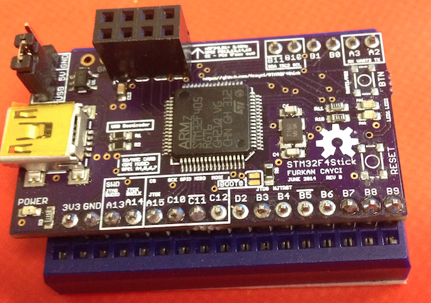
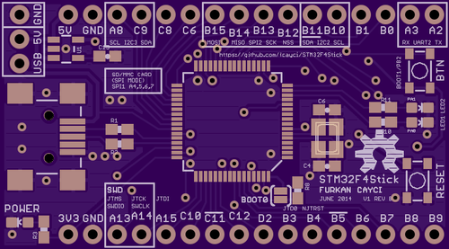
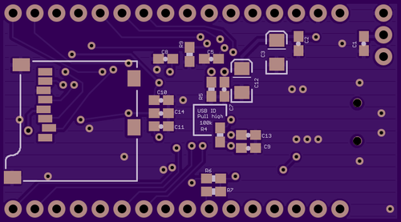

### STM32F4Stick - An STM32F405/STM32F401 based development board - Hardware

**There are two versions available with slight different mods. Checkout Ver1 or Ver2 branches for latest versions**

This board is intended to be a small bread-board friendly development environment for STM32F4 series microcontrollers. There are different versions some of which are not tested. Please contact me if you see any problems or have any suggestions.

#### STM32F4Stick VERSIONS:

##### VERSION 2:

* 1.84 x 1.02 inches board size
* STM32F405RG ARM Microcontroller
* STM32F401 ARM Microcontroller compatibility
* 16 MHz HSE Oscillator
* MiniUSB connector for power/programming (through bootloader)
* SD Card slot connected in SPI mode
* nRF24L01+ 2.4GHz radio module compatible header
* 1 x 16-pin breakout header and 1 x 6-pin header on both sides for easy breadboard development
* 2 x LEDs + 1 Push button
* Reset button
* Optional pull-ups on pins A10, B5, B11, and C11 for reliable USB bootloader
* Jump pads on BOOT0 pin, and push button on BOOT1 pin (Also act as a GPIO pin)

##### VERSION 1:

* 1.84 x 1.02 inches board size
* STM32F405RG ARM Microcontroller
* STM32F401 ARM Microcontroller compatibility
* 16 MHz HSE Oscillator
* MiniUSB connector for power/programming (through bootloader)
* SD Card slot connected in SPI mode
* 2 x 16-pin breakout headers on both sides for easy breadboard development
* 2 x LEDs + 1 Push button
* Reset button
* Optional pull-up / pull-downs on pins A10, B5, B11, and C11 for reliable USB bootloader
* Jump pads on BOOT0 pin, and push button on BOOT1 pin (Also act as a GPIO pin)

#### Possible Future Changes:
* FIX:
  * Locate and connect DAC pin(s) to the extension headers if they are not broken out already
* NEW:
  * Connect SD Card in SDIO mode
  * Add an I2C compatible chip for an on-board I2C part. Possibly an MPU6050/9150 part if it fits
  * Change to a Micro USB connector
