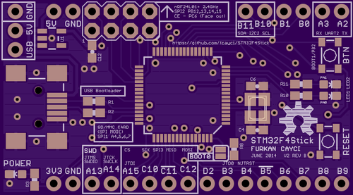
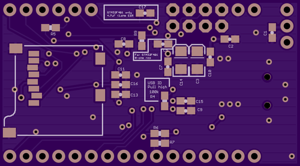

# STM32F4Stick - An STM32F405/STM32F401 based development board - Hardware
This board is intended to be a small bread-board friendly development environment for STM32F4 series microcontrollers. There are different versions some of which are not tested. Please contact me if you see any problems or have any suggestions.

Current Version Features:
* 1.84 x 1.02 inches board size
* STM32F405RG ARM Microcontroller
* STM32F401 ARM Microcontroller compatible
* 16 MHz HSE Oscillator
* MiniUSB connector for power/programming (through bootloader)
* SD Card slot connected in SPI mode
* nRF24L01+ 2.4GHz radio module compatible header
* 1 x 16-pin breakout header and 1 x 6-pin header on both sides for easy breadboard development
* 2 x LEDs + 1 Push button
* Reset button
* Optional pull-ups on pins A10, B5, B11, and C11 for reliable USB bootloader
* Jump pads on BOOT0 pin, and push button on BOOT1 pin (Also act as a GPIO pin)

## Hardware Versions

### Version 2
---
##### Top side:

##### Bottom side:

##### Changelog:

REV B:
* Added STM32F401 Compatibility. (R5/C5/C15/C17)
  * STM32F405:
    * Don't fit C17
    * R5 is optional pull-up
    * C5/C15 are 2.2uF ceramic capacitors
  * STM32F401:
    * Don't fit R5
    * C17 is 4.7uF ceramic capacitor
    * C5/C13 are 0 ohm resistors
    * PB11 pin is not available since it is changed to VCAP pin

REV A:
* 4x2-pin header for nRF24L01+ 2.4GHz radio connector
* 1.84 x 1.02 inches
* STM32F405RG ARM Microcontroller
* 16 MHz HSE Oscillator
* MiniUSB connector for power/programming (through bootloader)
* SD Card slot connected in SPI mode
* 1 x 16-pin breakout header and 1 x 6-pin header on both sides for easy breadboard development
* 2 x LEDs + 1 Push button
* Reset button
* Pull-ups on pins A10, B5, B11, and C11 for reliable USB bootloader
* Jump pads on BOOT0 pin, and push button on BOOT1 pin (Also act as a GPIO pin)

##### Pinout:

 Pin # | Pin Name | Functionality
------:|-----:|-------
 5  | PH0-OSC_IN | RCC_OSC_IN
 6  | PH1-OSC_OUT | RCC_OSC_OUT
 14 | PA0-WKUP | LED1
 15 | PA1 | LED2
 20 | PA4 | SPI1_NSS (SD Card)
 21 | PA5 | SPI1_SCK (SD Card)
 22 | PA6 | SPI1_MISO (SD Card)
 23 | PA7 | SPI1_MOSI (SD Card)
 28 | PB2 | BUTTON
 33 | PB12 | SPI2_NSS (nRF24L01+)
 34 | PB13 | SPI2_SCK (nRF24L01+)
 35 | PB14 | SPI2_MISO (nRF24L01+)
 36 | PB15 | SPI2_MOSI (nRF24L01+)
 37 | PC6 | CE (nRF24L01+)
 42 | PA9 | USB_OTG_FS_VBUS
 44 | PA11 | USB_OTG_FS_DM
 45 | PA12 | USB_OTG_FS_DP
